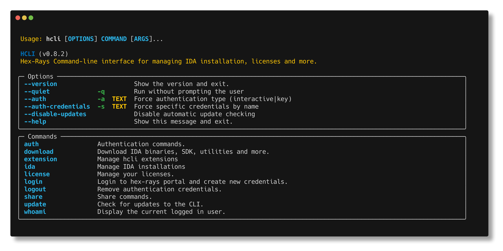

# HCLI Documentation



**HCLI** is a modern command-line interface for managing IDA Pro licenses, installations, ... Built with Python and designed for both interactive use and automation workflows.

## Binary Installation 

This will automatically install an **hclii** binary

=== "macOS"
    ```bash
    curl -LsSf https://hcli.docs.hex-rays.com/install | sh
    ```

=== "Linux"
    ```bash
    curl -LsSf https://hcli.docs.hex-rays.com/install | sh
    ```

=== "Windows"
    ```cmd
    iwr https://hcli.docs.hex-rays.com/install.ps1 | iex
    ```

## Python Installation 

```bash
pipx install ida-hcli  
hcli login 
```

## Key Features

- **Downloads** - Download and install IDA   
- **License Management** - Install and manage your IDA Pro licenses seamlessly  
- **File Sharing** - Securely share analysis files with Hex-Rays for support tickets
- **Cross-Platform** - Works on Windows, macOS, and Linux

